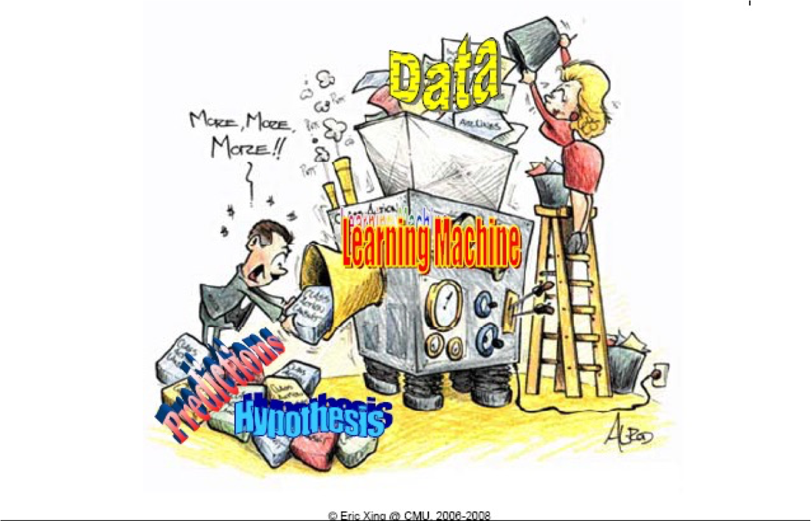
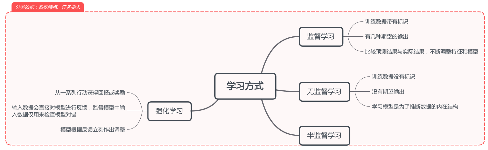

# 4.1 机器学习基本概念
对绝大多数人来说，机器学习意味着高薪、黑科技、AlphaGo、黑盒子……那么它到底是什么呢？我们通过一张漫画来简单了解一下。

在上面这张漫画里，你看到了什么?哪些是你觉得重要的点呢？

**数据**(Data) 
作为机器学习的主要输入，数据类似于燃料，常常决定了机器学习达到效果的上限。在这幅漫画中，男科学家在说“More,More,More！”（更多，更多，更多）数据的多少往往是机器学习实际应用的主要瓶颈。

**机器学习算法**(Learning Machine)
作为机器学习的核心，机器学习算法常常部署在一台或多台服务器上（LearningMachine，下简称机器），它接受输入的数据并产出预测结果和相关假设。
漫画中的机器学习算法很有意思：

（1）在机器上面有很多表盘，意味着机器学习算法常常有一些参数需要人工调节。这也是为什么人工智能被很多科学家／数据挖掘工程师自黑为“人工”的智能的原因。

（2）机器看上去是一个大的精密的设备（一个黑盒子）。这是机器学习目前遇到的最大难题之一：可解释性：包括输出结果的可解释性以及分析过程的可解释性。

（3）机器学习算法的输入和输出很不一样。它的输入多为一些杂乱无章的数据，输出多为一块一块的有序输出。在实际过程中，机器学习需要处理多源异构的输入数据（多源意味着不同的数据来源，异构表示输入数据包含了图片、文字、表格、视频等），而输出则相对统一。

（4）机器学习需要接电源。这意味着机器学习算法的部署和其他应用程序一样，离不开电。更近一步地，越来越多的机器学习任务需要消耗大量的计算能力和电力。

**预测结果**(Predictions)
预测（分类）是机器学习目前为止最广泛的应用之一。从猫狗识别到总统选举，从人脸识别到恶意行为检测，人们目前已将现实生活中的如此众多的分类任务交给了机器去完成。

**假设**(Hypothesis)
假设是输入／输出数据内蕴藏的某种内在客观规律。机器学习的输出实际上包含了在训练数据中学到的内在假设。而预测结果／分类结果将严格遵循这些内在假设。

总的来说，机器学习是一门利用[经验]来[自动]改善系统性能的技术。经验实际上是指在训练数据中学到的内在假设的一种具体体现。而自动，则反映出机器学习的本质：机器学习的本质是用来提升效率的。在某种意义上，有足够经验的人可以胜任绝大多数机器学习任务，但充分利用自动化的机器学习技术可以大量消灭人类重复性的劳动，进而提升效率。

# 机器学习问题分类

人们获取知识的两种主要思维方式是**归纳**和**演绎**。**归纳**主要指的是从个体到整体，而**演绎**是从一般推到特殊。
这一点同样在机器学习中有所体现。
从**归纳**这种思想出发，根据数据特点和任务要求的不同，有三类机器学习问题：监督学习，半监督学习，无监督学习。

**监督学习**

监督学习的训练数据带有标识，对每一个样本都有几种期望的输出。这种学习方式通过比较预测结果和实际结果来不断调整特征和模型，进而取得最好的输出结果。

**无监督学习**

和有监督学习不同，无监督学习的训练数据没有标识，对每一个样本没有期望的输出。这种学习方式的主要目的是推断数据的内在结构，最常见的应用场景是异常检测。

**半监督学习**

半监督学习介于有监督学习和无监督学习之间。它的一部分数据有标识，而大部分数据没有标识。对半监督学习而言，最大的难题在于如何高效的利用没有标识的数据进行学习。

作为**演绎**在机器学习中的体现，强化学习和上述三种问题在数据特点和任务要求上非常不一样。

**强化学习**

强化学习的模型会从一系列行动中获得反馈（包括奖励和惩罚），并根据反馈立即作出调整。和监督学习输入数据仅用来检查模型对错不同，强化学习的输入数据会直接对模型进行反馈，并指导模型完成相应调整。

如果我们把机器学习当做医生看病来理解的话，有监督学习就是给**医生**（机器学习模型）一些不同肿瘤的图片，然后让**医生**将患者的肿瘤类型划分到上面肿瘤类型中去；无监督学习就是**医生**对患者进行体检，发现可能的隐患或异常；强化学习就是**医生**参加培训，通过模拟手术对“病人”进行治疗，通过治疗的结果（康复／未康复）对医生的行为进行调节。

