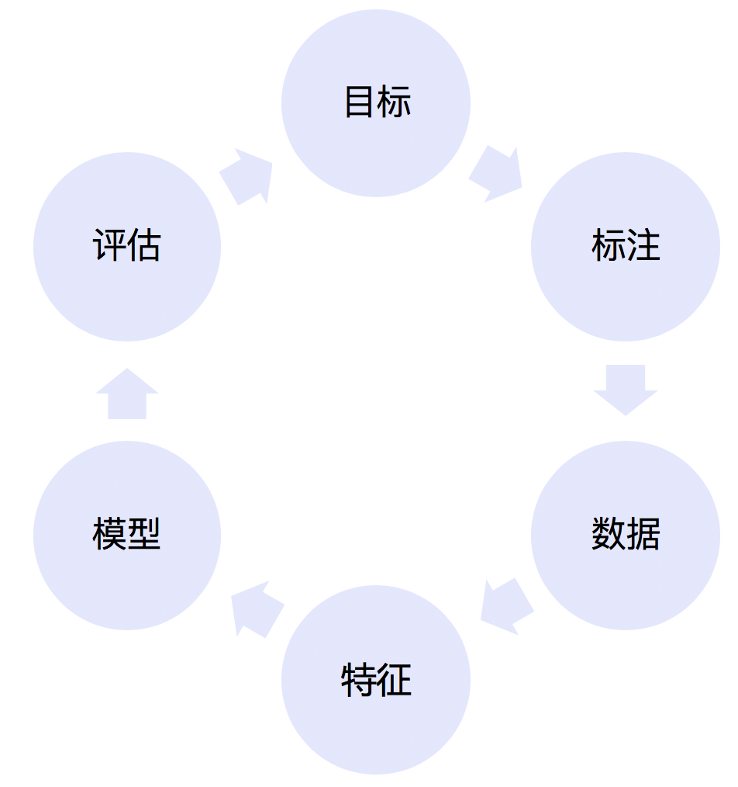

# 4.2 机器学习建模的步骤及挑战

在机器学习中，有监督学习是其中应用最广泛的一类建模问题。接下来，以有监督学习为例，介绍机器学习建模的一般步骤及挑战：

**4.2.1 目标&问题抽象**

在目标&问题抽象这一阶段，主要将**高价值**的业务问题抽象成**适合建模分析**的**原子**问题。这是所有机器学习建模的第一个步骤，也是决定建模成败的最重要的一个环节。

**适合建模分析**是一个很模糊的概念。一般来说，适合建模的问题需要满足两个条件：（1）不是随机发生的。例如抛掷硬币正反面的预测，实际上是一个伪命题（每个硬币的正反面是随机出现的）。（2）不是偶然事件。建模过程实际上是挖掘建模目标和数据之间的规律和联系。如果建模问题本身是偶然出现的，建模并不现实。
（3）问题和数据本身之间是有关的，最好是因果关系。如果问题和所获取的数据之间是无关的，即使能建模并在训练集上取得效果，也无法实际使用。

**原子问题**是对建模问题拆解的要求。一个复杂的业务问题常常可以拆解为若干个相关的子问题。例如，贷款人的信用评分问题本身可以拆解为贷前的申请评分（A卡，Applicaction score card）、贷中的行为评分卡（B卡，Behavior score card）和贷后的催收评分卡（C卡,Collection score card）。这类问题的拆解看似简单，但做好需要同时具备较深的领域知识和系统抽象能力。

**4.2.2 标签定义&标注**

问题抽象好以后，在标签定义&标注阶段，主要对样本打标。标注阶段主要为解决有监督学习的问题提供数据基础。这一阶段是机器学习过程中成本最高的阶段，也是时间周期最长、问题最突出的阶段。

标注的方法主要包括反馈式标注，人工标注等。

（1）**反馈式标注**。主要是利用样本的后验信息进行标注。例如，在银行风控场景中，需要评估一笔放贷的风险大小。这时运用历史上放贷的逾期记录，就可以作为标注的一种手段。反馈式标注的优点在于自动化标注、成本较低，并且标注结果无偏。但缺点是标注过程依赖后验数据的规模、完整性，并且在标注过程中噪音会比较大（以放贷风险评估为例，产生噪音的原因包括虚假的后验数据（如借新还旧）以及环境的变化（如经济形势衰退导致整体坏账率升高）等）。

（2）**人工标注**。不同于反馈式的标注，人工标注是通过建立SOP（Standard Operation Procedure）的方式，由标注人员来判断样本的类别或者目标的位置（常见于计算机视觉领域）。例如，在电商纠纷领域，需要评估一次纠纷的责任归属，可以让标注人员根据标注SOP，利用纠纷全过程的信息（包括但不限于视频、语音等）来判断责任归属。人工标注避免了对后验数据的依赖，但无法实现完全自动化、成本较高。在建立SOP的情况下，标注结果一般可认为是无偏的。

无论是否采用人工标注的方法，提前准备好标注数据都是整个机器学习建模中至关重要的环节。为此，需要在这一阶段重点关注以下两点：

（1）**标注方法的合理性**。在实际建模过程中，标注方法的优劣决定了标注结果的上限。而标注结果决定了模型拟合的上限。因此，考察标注方法背后的逻辑是否合理是标注工作的第一要务。

（2）**标注结果的准确性**。作为指导模型拟合的最终裁判者，标注结果的准确性至关重要。然而，在使用反馈式标注时，虚假的后验信息常常对标注结果的准确性构成巨大威胁。举例来说，在电商纠纷领域，如果使用反馈式标注，顾客的投诉进线是店主有责的一种理所当然的标注方式。但如果顾客出于某种利益诉求来投诉进线，那此时顾客投诉进线的后验信息就有可能失真，其标注结果的准确性就大大降低了。

另外，如果采用人工标注，需要尽早制定标注SOP（Standard Operation Procedure）并准备好待标注数据。此外，如果标注成本整体较高，还需要对标注结果的可复用性加以考量。

**4.2.3 数据采集&特征选择**

当标签定义好以后，需要采集尽可能多的样本，并在每个样本中引入尽可能相关的数据。例如，当预测用户是否会点击某个母婴用品的广告时，需要知道他是否适龄、是否有孩子等信息。从信息论的角度来看，预测样本标签的过程等价于减少样本标签的不确定性。通过引入相关信息（增加信息增益）的方式来减少预测标签的不确定，对准确预测标签至关重要。但在实际建模过程中，经常会碰到以下挑战：

（1）**数据缺失**。数据缺失常常发生在

（2）**特征稀疏**。

（3）**特征间相关度高**。

（4）**数据多源异构**。

（5）**流式数据特征表示**。

（6）**数据质量低**。

**4.2.4 模型选择&调优**

(5)**策略上线**

(6)**效果评估**

